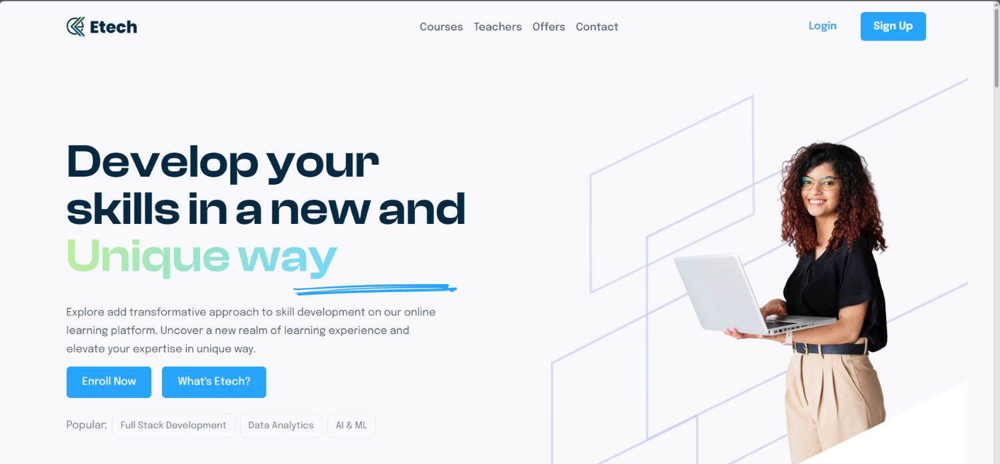

<div align="center">

<h1>Etech • E-Learning Platform</h1>
<p>Etech is a cutting-edge e-learning platform aimed at enhancing students' skills by providing diverse technical courses. It features dynamic course listings, smooth scrolling, <br> and a clean, responsive UI, ensuring a seamless and engaging learning experience for users.</p>

<br/>

[](https://etech-new.netlify.app/)

<br />
</div>

### Demo Screenshots

<div align="center">
  <br />
      
      <br />
  <br />
  <br />
</div>

<div align="center">
    
    
    
</div>
<br/>

# 🚀 Project Overview
**Etech** is a modern, responsive e-learning platform landing page designed to facilitate skills improvement through high-quality courses. Its features are tailored to provide an optimal user experience for learners exploring various technical fields.

## 🌟 Features

- Dynamic Course Listings: Offers a wide range of categorized courses to suit different skill levels and interests.
- Enhanced User Interface: Clean, responsive design optimized for all devices—desktop, tablet, and mobile.
- Smooth Scrolling: Provides effortless navigation powered by advanced scrolling functionality.
- Featured Courses: Highlights popular and trending technical courses, showcasing details like duration, level, and instructor information.
- Interactive Learning Tools: Enriched learning experience with integrated tools and resources.

## 🛠️ Tech Stack

- React: For creating interactive UI components.
- React Router v6: Enables seamless navigation between sections.
- Tailwind CSS: Provides streamlined and efficient styling.

## 🚀 Getting Started
To view and run this project locally, follow these steps:

### Prerequisites

Ensure you have the following installed:

- [Git](https://git-scm.com/)
- [Node.js](https://nodejs.org/en)
- [npm](https://www.npmjs.com/) (Node Package Manager)

### Steps

1. **Clone the repository:**

    ```bash
    git clone https://github.com/suniltechs/Etech-new.git
    ```

2. **Navigate to the project folder:**

    ```bash
    cd Etech
    ```

3. **Install the project dependencies:**

    ```bash
    npm install
    ```

4. **Run the project locally:**

    ```bash
    npm run dev
    ```

5. Visit [http://localhost:5173/](http://localhost:5173/) in your browser to view and explore the project.

---
